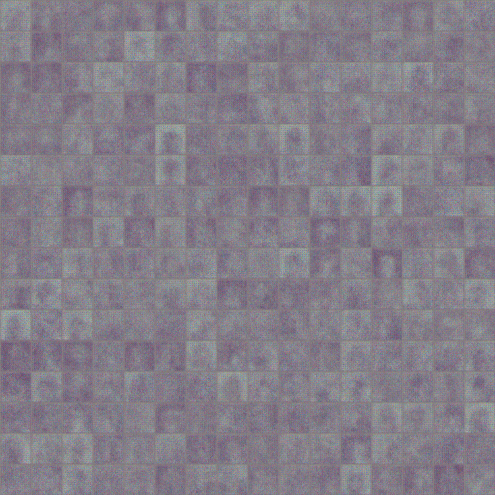
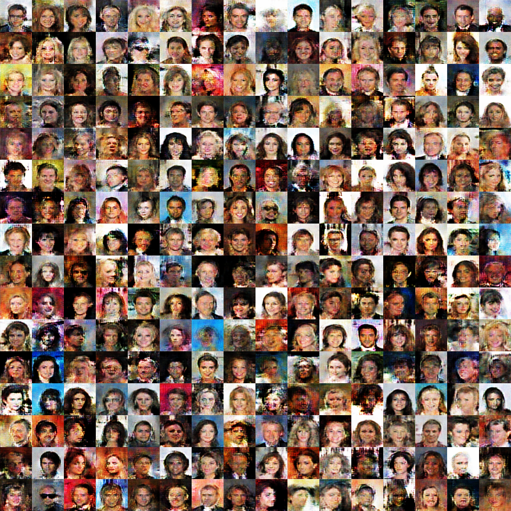

# Improved WGAN Implementation

The goal of this notebook is to implement improved WGAN model which is introduced in this [paper](https://arxiv.org/pdf/1704.00028.pdf).

## Dataset

The dataset used in this notebook is using CelebA Dataset: [Dataset](https://www.kaggle.com/c/datalab-lab-14-2/data?fbclid=IwAR0z0lDESiGwLJ8o00b2V5YrKq01SpFkx6t2jbeNaWQ7g_MMIllaa1nuYU0#)

## How To Run?
Language: Python 3+  
Recommended way of running: use the `jupyter notebook` command

## Result

Beginning of training process:  
  

End of training process:

Note: this is the result after running for 96 epochs, the end result might be even better if it is run for a longer amount of epochs.
